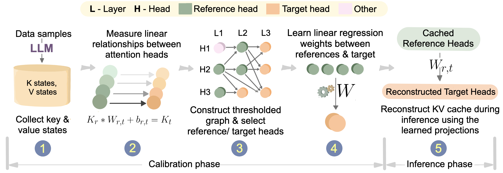

# Interpretability and Linear Predictability of Attention Heads

This project investigates the relationships among attention heads in Large Language Models (LLMs) to improve their efficiency and performance. Our key findings reveal that individual attention heads can be accurately approximated using linear projections of other heads - a property that emerges during pretraining despite not being explicitly designed into the Transformer architecture.

Building on this insight, we introduce a novel method for compressing the KV cache that utilizes these projections to reduce storage requirements, achieving up to 2× compression on various models with marginal performance loss. We validate this compression technique across diverse tasks including mathematics, coding, and general knowledge (MMLU).

Our work uncovers a significant structural property of attention mechanisms and demonstrates its practical utility for efficient LLM inference.




## Requirements

### Hardware
- GPU memory > 40GB

### Setup

``` bash
pip install -r requirements.txt
```

Also setup huggingface using ```huggingface cli```

## Test the setup

``` bash
python tests/test_kv_prediction.py
```

## Reproduce the results

### Table 1 (Main Results)
- **Llama3 8B**: Run `./neurips_experiments/table1/llama3.sh` to reproduce the Llama3 8B results in Table 1. Tested ✅

### Figure 1
- **Middle Figure**: Run `./neurips_experiments/figure1/middle_figure.sh` to reproduce the middle panel of Figure 1. Tested ✅
- **Right Figure**: TO-DO 

- **Falcon3 10B**: Run `./neurips_experiments/table1/falcon3.sh` to reproduce the Falcon3 10B results in Table 1. Tested ✅

- **Qwen3 32B**: Run `./neurips_experiments/table1/qwen3.sh` to reproduce the Qwen3 32B results in Table 1. Tested ✅

### Figure 2
- **Left Figure**: Run `./neurips_experiments/figure2/left_figure.sh` to reproduce the left panel of Figure 2.  Tested ✅

- **Middle Figure**: Run `./neurips_experiments/figure2/middle_figure.sh` to reproduce the middle panel of Figure 2.  Tested ✅

- **Middle Figure**: Run `./neurips_experiments/figure2/right_figure.sh` to reproduce the middle panel of Figure 2.  Tested ✅


### Figure 3
- **Left and Right Figure**: Run `./neurips_experiments/figure3/left_figure.sh` to reproduce both the panels of Figure 3.  Tested ✅

### Figure 4
- **Left Figure**: Run `./neurips_experiments/figure4/left_figure.sh` to reproduce the left panel of Figure 2.  Tested ✅


## File Guide

### Attention Augmentation for KV Collection

- `models/llama3_modelling_aug_collect.py` - Llama3 model with KV collection augmentation
- `models/olmo2_modelling_aug_collect.py` - OLMo2 model with KV collection augmentation  
- `models/qwen3_modelling_aug_collect.py` - Qwen3 model with KV collection augmentation

### Attention Augmentation for KV Prediction

- `models/llama3_modelling_aug_predict.py` - Llama3 model with KV prediction augmentation
- `models/olmo2_modelling_aug_predict.py` - OLMo2 model with KV prediction augmentation
- `models/qwen3_modelling_aug_predict.py` - Qwen3 model with KV prediction augmentation

> **Note**: Falcon models use the Llama attention mechanism, so they utilize the `llama3_modelling_aug_*.py` files.


